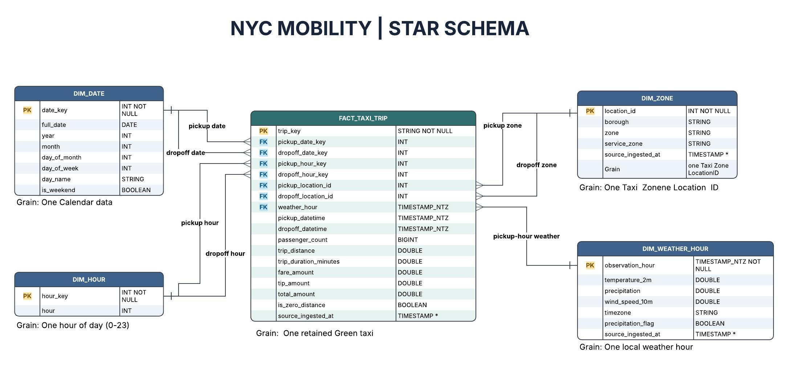

# Gold star schema

The Gold model supports three questions: when and where taxi demand peaks, how weather relates to trips, and which zones show sustained activity. The model is built by `notebooks/04_gold/gold_marts.py` from the three Silver views.

| Object | Grain | Key or link | Purpose |
| --- | --- | --- | --- |
| `fact_taxi_trip` | One retained Green Taxi trip | `trip_key` | Counts, distance, duration, fares; pickup and dropoff date, hour, and zone keys; pickup weather hour |
| `dim_date` | One calendar date | `date_key` | Date, weekday, weekend flag |
| `dim_hour` | One hour of day | `hour_key` (0–23) | Pickup and dropoff hour |
| `dim_zone` | One Taxi Zone | `location_id` | Borough, zone, service zone; reused for pickup and dropoff |
| `dim_weather_hour` | One local weather observation hour | `observation_hour` | Temperature, precipitation, wind speed, timezone, precipitation flag |

Join `fact_taxi_trip.weather_hour` to `dim_weather_hour.observation_hour`. Weather is measured once per hour at one observation location and reused across trips picked up in that hour; it does not describe conditions in each pickup zone. Pickup and dropoff roles use the same date, hour, and zone dimensions.

**Measures:** Count fact rows for demand. Use `trip_duration_minutes` for travel time. Apply the shared distance rule when aggregating: trips above `max_valid_distance_miles` remain in trip counts and are flagged, but are excluded from distance totals and averages. See [distance quality](distance_quality.md).

**Implementation note:** These Gold objects, including `vw_mobility_daily`, are SQL views; the daily view groups pickups by date and zone. The supplied diagram includes `source_ingested_at` on the fact, zone, and weather tables, but those fields are not present in the current Gold views. The Bronze file audit is stored separately in `nyc_quality.bronze_file_runs`. Add lineage timestamps to the source and Gold definitions before presenting the diagram as the implemented schema.
